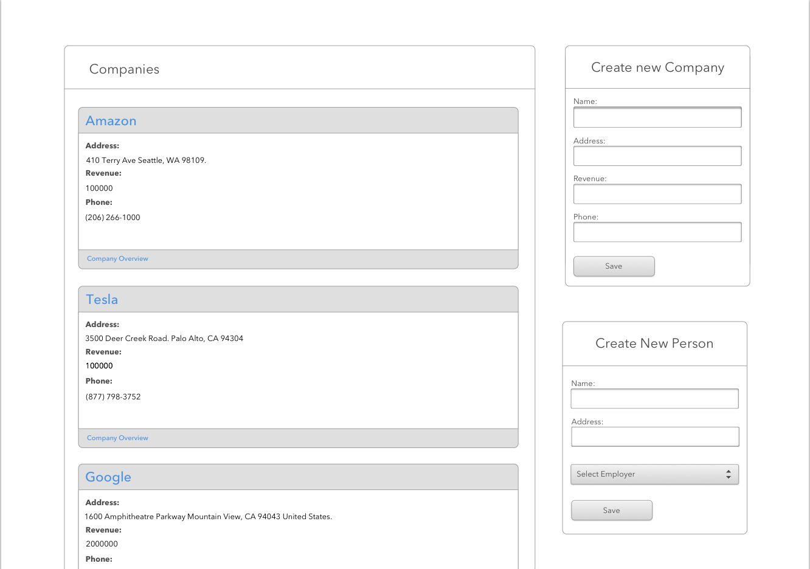
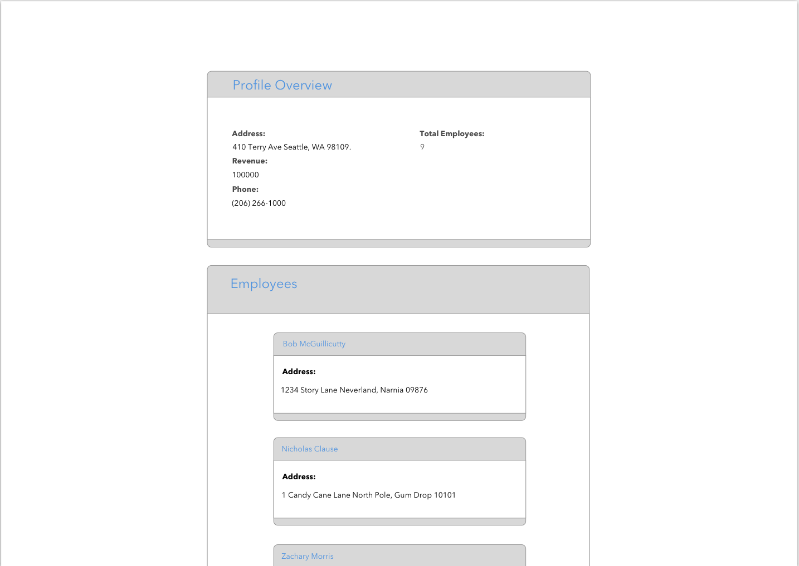

# React/Redux Code Challenge
This challenge was created to test your ability to code in a React environment. 
Furthermore, this challenge will allow our team to review your ability to adapt to patterns in 
architecture and coding style. In addition, this challenge will assess decision making skills in 
regard to managing state.

## Table of Contents
- [Getting Started](#getting-started)
- [Motivations](#challenge-motivations)
- [Objectives](#challenge-objectives)
- [Extras](#extra-objectives)

### Getting Started
- `yarn` to get your dependencies (you'll have to have yarn installed).
- `yarn start` to fire up your webpack environment for viewing in your browser of choice.

## Challenge Motivations
- Show the ability to create components in JSX that follow a design mockup.
- Show proficiency in creating **reusable** components in React.
- Use React best practices in managing information.
- Use Redux to manage state at the application level.
- Use a CSS preprocessor (LESS is installed by default, however SASS or SCSS can be used)
- Use good judgement in deciding types of components (container, presentational, HOC)

## Challenge Objectives
- Have fun!
- The Numbers Page and bean counter widget were built solely as an example in architecting the directory structure and it's child files.
You can choose to keep it or remove it. 

- Create the widgets you see in the image below in the HomePage component. 
    - The widget titled _Create New Company_ should have the behavior of adding new companies to the widget entitled _Companies_
    - The widget titled _Create New Person_ should add employees to a company's roster of employees. If no companies are entered, this widget should be disabled or not visible, candidate's choice.
    - The widget title _Companies_ should present all of the companies that have been entered, each with their own card.
    - The company cards should provide the data entered from the _Create New Company_ widget, and also have a link to the DetailsPage.
    The Details page will then display the respective companies information on click/key press.
    - If no companies have been entered, a message saying: _There are currently no companies to review._ should be provided to the user.
    - Validation should be provided in the following manner: **No fields should be empty or have falsy values**

- Create the widgets you see in the image below in the DetailsPage component.
    - The widget entitled _Profile Overview_ should display a company's information entered from the Home page in addition to the number of employees entered in the HomePage _Create New Person_ widget. 
    - The widget entitled _Employees_ should display the employees that are affiliated with the company that was chosen from the drop down on the _Create New Person_ widget from the Home page. 

- Upon completion of the above objectives, add some notes to `Notes.md` for those reviewing your code that you might feel is beneficial to us.
    - These can include thoughts about decisions you made in design, dependency change, state/store management, etc.
## Extra Objectives
- The styling for this mockup is fairly bland, if you feel inspired, make it your own by enriching the design.
- Want to show off your understanding of asynchronous behavior in React/Javascript? 
Add an additional widget that pulls information from a sample API like [JSON Placeholder!](https://jsonplaceholder.typicode.com/)
- Feel like the setup for this code challenge was lacking something vital or beneficial? Mention that in the `NOTES.md` file.
